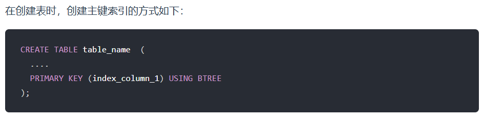
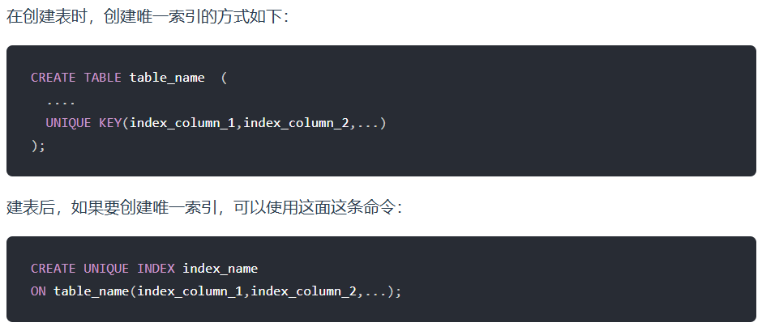
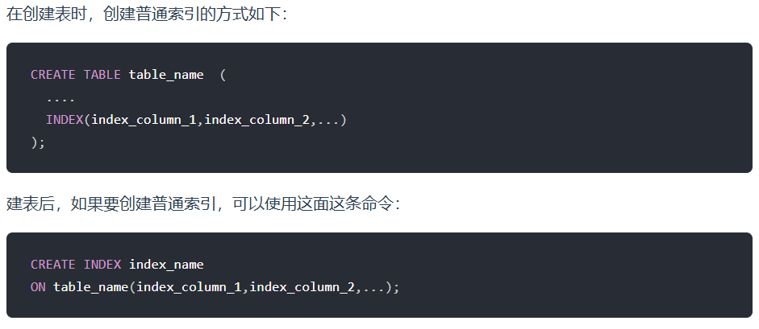
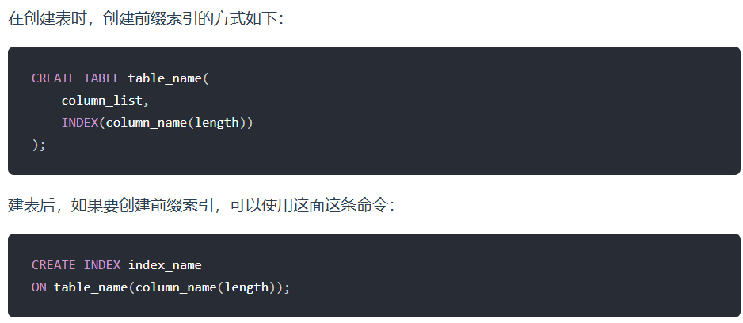

# SQL基础

## 1. NOSQL和SQL的区别？

SQL数据库，指关系型数据库，主要代表有：SQL server，Oracle和MySQL。

关系型数据库存储结构化数据。这些数据逻辑上以行列二维表的形成存在，每一列代表数据的一种属性，每一行代表一个数据实体。


NoSQL指非关系型数据库，主要代表有MongoDB，Redis。NoSQL数据库逻辑上提供了不同于二维表的存储方式，存储方式可以是JSON文件，哈希表或者其他方式。


选择 SQL vs NoSQL，考虑以下因素。

1. ACID vs BASE

   关系型数据库支持ACIO，相对而言，NoSQL采用更宽松的模型BASE，即基本可用，软状态和最终一致性。

2. 扩展性

   **NoSQL数据之间无关系**，这样就非常容易扩展，也无形之间，在架构的层面上带来了可扩展的能力。比如 redis 自带主从复制模式、哨兵模式、切片集群模式。

   

   **相反关系型数据库的数据之间存在关联性**，水平扩展较难 ，需要解决跨服务器 JOIN，分布式事务等问题。

   

## 2. 数据库的三大范式是什么？

**第一范式（1NF）：要求数据库表的每一列都是不可分割的原子数据项。**

**第二范式（2NF）：在1NF的基础上，非码属性必须完全依赖于候选码（在1NF基础上*消除非主属性对主码的部分函数依赖*）**

通俗来讲就是如果主键是两个属性，有非主属性可由主键中的一个属性决定，这种情况需要拆分出一个新表，新表包含属性由主键中的那一个属性和那个非主属性。

**第三范式（3NF）：在2NF基础上，任何非主属性不依赖于其它非主属性（在2NF基础上*消除传递依赖*）**

比如学号->班主任姓名，班主任姓名->班主任性别和班主任姓名->班主任年龄，存在了传递依赖，需要拆分出一个新表为班主任姓名、班主任性别和班主任年龄。

*解释：*

函数依赖：数据表中不存在两个元组在X上属性值相等，而在Y上的属性值不等，则为X->Y 称X函数确定Y或Y函数依赖于X。X、Y是属性或属性集。（f（X） = Y，换言之，就是Y完全由X决定，一对多不行，多对一可以）

完全函数依赖：在数据表中，如果X->Y，并且对于X的任何一个真子集X\`，都是X\`!->,则称Y对X完全函数依赖。（保小）

部分函数依赖：如果X->Y，但Y不完全函数依赖于X，则称Y对X部分函数依赖。、

候选码。K是属性或属性集，如果记录完全函数依赖K，则K为候选码。

超码。P是属性或属性集，如果记录部分函数依赖P，则P为超码。

主码。若候选码超过一个，选择一个作为主码。

主属性/码：包含在任何一个候选码中的属性称为主属性。

非主/码属性：不包含在任何候选码中的属性。

## 3. MySQL怎么连表查询？

数据库有四种连表查询：

1. 内连接 .. inner join ... on ...  取两个表都有的记录
2. 左外连接 ...left join ... on ... 取左表全部记录
3. 右外连接 ...right join ... on ... 取右表全部记录
4. 全外连接  MySQL不支持，使用UNION来实现，用UNION连接一个左外连接一个右外连接，UNION去重。

## 4. MySQL如何避免重复插入数据？

对键加unique约束，然后用INSETRT ignore。

方式一：

​	在建表的时候为某一列添加**UNIQUE约束**；

方式二：

​	**使用Insert...on duplicate key update xxx=values(xxx),yyy=values(yyy)**

​	如果插入的数据中的唯一属性或主键与表中的重复，则更新记录，更新的字段是xxx和yyy

​	如果插入的数据中的唯一属性或主键与表中的不重复，则插入

​	可实现如果之前有这条数据，就做更新；如果没有，就做新增。

方式三：

​	**使用INSERT IGNORE**： 该语句会在插入记录时忽略那些因重复键而导致的插入错误，不插入那些重复键的数据。

如果想保证键唯一，用方法一

如果想对重复的数据更改，不重复的插入，用方法二

如果想忽略重复数据，不插入，则方法三。

​	

## 5. CHAR和VARCHAR有什么区别？

* **CHAR是固定长度的字符串类型，定义时需要指定固定长度，存储时会在末尾补足空格。**CHAR适合存储长度固定的数据，如固定长度的代码、状态等，存储空间固定，对于短字符串效率较高。
* **VARCHAR是可变长度的字符串类型，定义时需要指定最大长度，实际存储时根据实际长度占用存储空间。**VARCHAR适合存储长度可变的数据，如用户输入的文本、备注等，节约存储空间。

## 6. Text数据类型可以无限大吗？

不可以

MySQL中3中text类型的最大长度如下：

* TEXT：65,535 bytes ~64kb

* MEDIUMTEXT：16,777,215 bytes ~16Mb

* MEDIUMTEXT：4,294,967,295 bytes ~4Gb

## 7. 说一说外键约束

外键约束的作用是维护**表与表之间的关系**，确保数据的完整性和一致性。

## 8. MySQL的关键字in和exists

子查询可以用在增删改查语句中的任何一个；

子查询可以用在where，from，select之后。

 **IN关键字：**

```sql
select * from A
where id in (
    select id from B
);
```

1. 首先执行内查询select id from B，然后将查询符合的所有数据的id传给外查询。
2. 外查询根据内查询返回的所有id, 执行select * from A where id in查询符合的数据返回。

总结：先查内查询，然后用内查询数据做外查询返回符合记录。如果外查询数据量大，内查询数据量小，并且外查询有索引情况，使用in比exists查询效率高。

**EXIST关键字：**

```sql
select * from A a
where exists (
    select 1 from B b where a.id = b.id
);
```

1. 首先执行外查询select * from A a，然后从外查询的数据取出一条数据传给内查询。
2. 内查询执行select * from B b，外查询传入的数据和内查询获得数据根据where后面的条件做匹对，如果存在数据满足a.id=b.id则返回true，如果一条都不满足则返回false。
3. 内查询返回true，则外查询的这行数据保留，反之内查询返回false则外查询的这行数据不显示。外查询的所有数据逐行查询匹对。

总结：先查外查询，然后用外查询数据去内查询根据where做匹配，如果存在则保留外查询记录。如果外查询数据量小，内查询数据量大，使用exists效果比in查询高。

## 9. mysql中的一些基本函数，你知道哪些？

1. 字符串函数

   CONCAT(str1, str2, ...) ：连接多个字符串，返回一个合并后的字符串。

   LENGTH(str)：返回字符串的长度（字符数）。

   SUBSTRING(str, pos, len)：从指定位置开始，截取指定长度的子字符串。

   REPLACE(str, from_str, to_str)：将字符串中的某部分替换为另一个字符串。将str字符串中的from_str替换成to_str

2. 数值函数

   ABS(num)：返回数字的绝对值。

   POWER(num, exponent)：返回指定数字的指定幂次方。

   floor（num）：向下取整

   ceil（num）：向上取整

   rand（）：0-1内的随机数

   round（x，y）：对x四舍五入，保留y位小数

3. 日期函数

   NOW()：返回当前日期和时间。

   CURDATE()：返回当前日期。

4. 聚合函数

   COUNT(column)：计算指定列中的**非NULL值的个数**。

   SUM(column)：计算指定列的总和。

   AVG(column)：计算指定列的平均值。

   MAX(column)：返回指定列的最大值。

## 10. sql题：给学生表、课程成绩表，求不存在01课程但存在02课程的学生的成绩

```
先内连接查出选了02课程的学生，再用no exists去除选择了01课程的学生。
```


## 11. sql题：给学生表、课程成绩表，求不存在01课程但存在02课程的学生的成绩

```sql
WITH product_sales AS (
  SELECT product_id, SUM(sales) as total_sales, SUM(profit) as total_profit
  FROM sales_data
  GROUP BY product_id
),
product_sales_with_rank AS (
  SELECT product_id, total_sales, total_profit,
         RANK() OVER (ORDER BY total_sales DESC) as sales_rank,
         RANK() OVER (ORDER BY total_profit DESC) as profit_rank
  FROM product_sales
)
SELECT product_id, total_sales, total_profit,
       sales_rank, profit_rank
FROM product_sales_with_rank;

```

WITH AS 语法是MySQL中的一种临时结果集，它可以在[SELECT](https://so.csdn.net/so/search?q=SELECT&spm=1001.2101.3001.7020)、INSERT、UPDATE或DELETE语句中使用。通过使用WITH AS语句，可以将一个查询的结果存储在一个临时表中，然后在后续的查询中引用这个临时表。这样可以简化复杂的查询，提高代码的可读性和可维护性。

**窗口函数：**

​	[MySQL窗口函数（MySQL Window Functions）-CSDN博客](https://blog.csdn.net/frostlulu/article/details/130729113?ops_request_misc=%7B%22request%5Fid%22%3A%22172252648816800186543298%22%2C%22scm%22%3A%2220140713.130102334..%22%7D&request_id=172252648816800186543298&biz_id=0&utm_medium=distribute.pc_search_result.none-task-blog-2~all~top_positive~default-2-130729113-null-null.142^v100^pc_search_result_base7&utm_term=mysql窗口函数&spm=1018.2226.3001.4187)


1. sum(val) over (partition by wind) group_sum
   

OVER: 表明rank()为一个窗口函数。

(partition by wind)：表示按wind分组计算，如果（）里面不写则以全表为一组。

（）：括号内也可以写对窗口的进一步加工。


除了上面示例的sum，其他的聚合函数例如count, max, min, avg等都可以作为窗口函数使用，但是专用窗口函数在数据分析中更加常用。专用窗口函数在使用时必须搭配 over 关键字。


专用窗口函数如：**row_number()**   **rank()**


## 12. 执行一条SQL请求的过程是什么？

连接器-------解析sql---------执行sql

1. 连接器：建立连接，访问服务层解析器，管理连接、校验用户身份；
2. 解析 SQL，通过解析器对 SQL 查询语句进行词法分析、语法分析，然后构建语法树，方便后续模块读取表名、字段、语句类型；
3. 执行sql：
   * 预处理阶段：检查表或字段是否存在；将 select * 中的  符号扩展为表上的所有列。
   * 优化阶段：基于查询成本的考虑， 选择查询成本最小的**执行计划**；
   * 执行阶段：根据执行计划执行 SQL 查询语句，从**存储引擎**读取记录，返回给客户端；

首先于mysql服务器建立连接，将sql语句发送给服务器，服务器接收到sql语句后，解析它，解析的过程是。。。再之后执行sql语句，

# 存储引擎

## 13. 讲一讲mysql的引擎吧，你有什么了解？

mysql的存储引擎有innoDB、myisam、memory等

innodb：在mysql5.5之后，默认使用innodb存储引擎。

​	特点：

​		DML操作遵循ACID模型，支持事务；

​		使用行级锁提高并发访问性能；

​		支持外键约束，保证数据的完整性和正确性。

myisam：mysql早期默认的存储引擎。

​	特点：

​		不支持外键，不支持事务，支持表锁，不支持行锁，访问速度快，适用于大量读操作的场景。

memory：

​		memory引擎的表数据是存储在内存中的，适用于对性能要求较高的读操作，但是在服务器重启或崩溃时数据会丢失。它不支持事务、行级锁和外键约束。

## 14. MySQL为什么InnoDB是默认引擎？

InnoDB引擎在事务支持、并发性能、崩溃恢复等方面具有优势，因此被MySQL选择为默认的存储引擎。

* 事务支持：InnoDB引擎提供了对事务的支持，可以进行ACID（原子性、一致性、隔离性、持久性）属性的操作。Myisam存储引擎是不支持事务的。
* 并发性能：InnoDB引擎采用了行级锁定的机制，可以提供更好的并发性能，Myisam存储引擎只支持表锁，锁的粒度比较大。
* 崩溃恢复：InnoDB引引擎通过 **redolog** 日志实现了崩溃恢复，可以在数据库发生异常情况（如断电）时，通过日志文件进行恢复，**保证数据的持久性和一致性。**Myisam是不支持崩溃恢复的。

## 15. 说一下mysql的innodb与MyISAM的区别？

* 事务：InnoDB 支持事务，MyISAM 不支持事务，这是 MySQL 将默认存储引擎从 MyISAM 变成 InnoDB 的重要原因之一。
* 索引结构：InnoDB 是聚簇索引，MyISAM 是非聚簇索引。聚簇索引的文件存放在主键索引的叶子节点上，因此 InnoDB 必须要有主键，通过主键索引效率很高。但是辅助索引需要两次查询，先查询到主键，然后再通过主键查询到数据。因此，主键不应该过大，因为主键太大，其他索引也都会很大。而 MyISAM 是非聚簇索引，数据文件是分离的，索引保存的是数据文件的指针。**主键索引和辅助索引是独立的。**
* 锁粒度：InnoDB 最小的锁粒度是行锁，MyISAM 最小的锁粒度是表锁。一个更新语句会锁住整张表，导致其他**查询和更新都会被阻塞，因此并发访问受限。**
* count 的效率：InnoDB 不保存表的具体行数，执行 select count(*) from table 时需要全表扫描。而MyISAM 用一个变量保存了整个表的行数，执行上述语句时只需要读出该变量即可，速度很快。


## 16. 数据管理里，数据文件大体分成哪几种数据文件？

我们每创建一个 database（数据库） 都会在 /var/lib/mysql/ 目录里面创建一个以 database 为名的目录，然后保存表结构和表数据的文件都会存放在这个目录里。

回答：

大体分为三种数据文件：分别是.opt文件，.frm文件和.ibd文件  

> 这是mysql5版本的文件吧，八以后就剩ibd了吧

* .opt文件：db.opt，用来存储当前数据库的默认字符集和字符校验规则。

* .frm文件：t_order.frm ，t_order 的**表结构会保存在这个文件**。在 MySQL 中**建立一张表都会生成一个.frm 文件**，该文件是用来保存每个**表的元数据信息的，主要包含表结构定义。**

* .ibd文件：t_order.ibd，t_order 的**表数据会保存在这个文件**。

  表数据既可以存在共享表空间文件（文件名：ibdata1）里，也可以存放在独占表空间文件（文件名：表名字.ibd）。

  这个行为是由参数 innodb_file_per_table 控制的，若设置了参数 innodb_file_per_table 为 1，则会将存储的数据、索引等信息单独存储在一个独占表空间，从 MySQL 5.6.6 版本开始，它的默认值就是 1 了，因此从这个版本之后， MySQL 中每一张表的数据都存放在一个独立的 .ibd 文件。

# 索引

## 17. 索引是什么？有什么好处？

​	索引是帮助mysql高效获取数据的数据结构（有序），主要是用来提高数据检索的效率，降低数据库的**io成本**（不需要全表扫描），同时，通过索引列对数据进行排序，降低数据排序的成本，降低了**cpu的消耗**。

## 18. 讲讲索引的分类是什么？

* 按物理存储分类：聚簇索引（主键索引），二级索引（辅助索引）

* 按数据结构分类：B+树索引，Hash索引，Full-text索引。

* 按字段特性分类：主键索引，唯一索引，普通索引，前缀索引

  **主键索引：**索引列不允许有空值，只有一个主键索引

  

  **唯一索引：**唯一索引建立在 **UNIQUE** 字段上的索引，一张表可以有**多个**唯一索引，索引列的值必须**唯一**，但是**允许有空值**。

  

  

  **普通索引：**普通索引就是建立在普通字段上的索引，既不要求字段为主键，也不要求字段为 UNIQUE。

  

  

  **前缀索引：**前缀索引是指对**字符类型字段的前几个字符**建立的索引，而不是在整个字段上建立的索引，前缀索引可以建立在字段类型为 char、 varchar、binary、varbinary 的列上。

  

  

* 按字段个数分类：单列索引，联合索引

  联合索引有最左匹配原则。因为联合索引查询的 B+Tree 是先按 product_no 进行排序，然后再 product_no 相同的情况再按 name 字段排序。

## 19.  MySQL聚簇索引和非聚簇索引的区别是什么？

聚簇索引：将**数据与索引**放在了一起，B+树的叶子节点保存了整行数据，并且有且只有一个。

非聚簇索引：**数据与索引**分开存储，B+树的叶子节点保存行数据的主键，可以有多个。

聚簇索引的索引键的选择：

1. 如果有主键，默认会使用主键作为聚簇索引的索引键；
2. 如果没有主键，就选择第一个不包含null值的带有唯一约束的键作为聚簇索引的索引键；
3. 在上面两个都没有的情况下，innodb将自动生成一个隐式自增id列作为聚簇索引的索引键。

## 20. 什么是回表查询？什么时候发生？

先介绍聚簇索引与二级索引。回表查询与聚簇索引和二级索引有关，什么是聚簇索引，什么是二级索引。

回表的意思是通过二级索引找的对应的主键值，然后再通过主键值找到找到聚簇索引中对应的整行数据，这个过程就是回表。

发生在不是覆盖索引时，数组不在二级索引中。

## 21. 如果聚簇索引的数据更新，它的存储要不要变化？

变化，要维护B+树的有序性。

* 如果更新的数据是非索引数据，也就是普通的用户记录，那么存储结构是不会发生变化
* 如果更新的数据是索引数据，那么存储结构是有变化的，因为要维护 b+树的有序性

