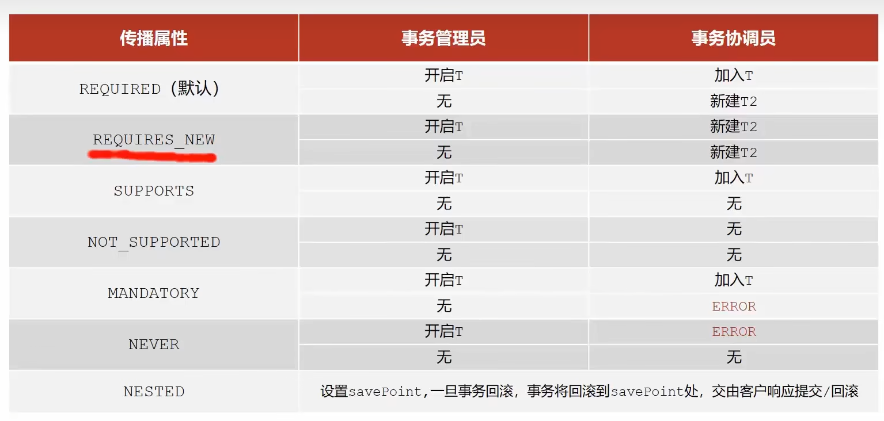

# Spring

## 谈谈自己对于Spring IOC的了解

**IoC（Inversion of Control:控制反转）** 是一种设计思想，而不是一个具体的技术实现。IoC 的思想就是将原本在程序中手动创建对象的控制权，交由 Spring 框架来管理。不过， IoC 并非 Spring 特有，在其他语言中也有应用。 IoC 容器实际上就是个 Map（key，value）,Map 中存放的是各种对象。

**注入**：将对象之间的相互依赖关系交给 IoC 容器来管理，并由 IoC 容器完成对象的注入。

## 将一个类声明为Bean的注解有哪些？

> - `@Component`：通用的注解，可标注任意类为 `Spring` 组件。如果一个 Bean 不知道属于哪个层，可以使用`@Component` 注解标注。
> - `@Repository` : 对应持久层即 Dao 层，主要用于数据库相关操作。
> - `@Service` : 对应服务层，主要涉及一些复杂的逻辑，需要用到 Dao 层。
> - `@Controller` : 对应 Spring MVC 控制层，主要用于接受用户请求并调用 `Service` 层返回数据给前端页面。

## @Component 和 @Bean 的区别是什么？

- `@Component` 注解作用于类，而`@Bean`注解作用于方法。
- `@Component`通常是通过类路径扫描来自动侦测以及自动装配到 Spring 容器中（我们可以使用 `@ComponentScan` 注解定义要扫描的路径从中找出标识了需要装配的类自动装配到 Spring 的 bean 容器中）。`@Bean` 注解通常是我们在标有该注解的方法中定义产生这个 bean,`@Bean`告诉了 Spring 这是某个类的实例，当我需要用它的时候还给我。
- 有时我们只能通过 `@Bean` 注解来注册 bean。比如当我们引用第三方库中的类需要装配到 `Spring`容器时，则只能通过 `@Bean`来实现。

## 注入 Bean 的注解有哪些？

Spring 内置的 `@Autowired` 以及 JDK 内置的 `@Resource` 都可以用于注入 Bean。

* `@Autowired`：默认的注入方式为`byType`，如果通过类型不能找到唯一的对象（接口有两个实现类）的话，则使用 `byName`（根据名称进行匹配）的注册方式，这个名称通常就是类名（首字母小写）。【寻找类的名称与变量名称一致的对象】`@Autowired`也可以与`@Qualifier`组合使用，@Qualifier来显式指定名称而不是依赖变量的名称。`@Autowired` 支持在**构造函数、方法、字段和参数**上使用。


* `@Resource`属于 JDK 提供的注解，默认注入方式为 `byName`。如果无法通过名称匹配到对应的 Bean 的话，注入方式会变为`byType`。`@Resource` 有两个比较重要且日常开发常用的属性：`name`（名称）、`type`（类型）。如果仅指定 `name` 属性则注入方式为`byName`，如果仅指定`type`属性则注入方式为`byType`，如果同时指定`name` 和`type`属性（不建议这么做）则注入方式为`byType`+`byName`。`@Resource` 主要用于**字段和方法**上的注入，不支持在构造函数或参数上使用。


## Bean 的作用域有哪些?

Spring 中 Bean 的作用域通常有下面几种：

- **singleton** : IoC 容器中只有唯一的 bean 实例。Spring 中的 bean 默认都是单例的，是对单例设计模式的应用。
- **prototype** : 每次获取都会创建一个新的 bean 实例。也就是说，连续 `getBean()` 两次，得到的是不同的 Bean 实例。
- **request** （仅 Web 应用可用）: 每一次 HTTP 请求都会产生一个新的 bean（请求 bean），该 bean 仅在当前 HTTP request 内有效。
- **session** （仅 Web 应用可用） : 每一次来自新 session 的 HTTP 请求都会产生一个新的 bean（会话 bean），该 bean 仅在当前 HTTP session 内有效。
- **application/global-session** （仅 Web 应用可用）：每个 Web 应用在启动时创建一个 Bean（应用 Bean），该 bean 仅在当前应用启动时间内有效。
- **websocket** （仅 Web 应用可用）：每一次 WebSocket 会话产生一个新的 bean。

**如何配置 bean 的作用域呢？**

```java
@Bean
@Scope(value = ConfigurableBeanFactory.SCOPE_PROTOTYPE)
public Person personPrototype() {
    return new Person();
}
```

## Spring框架中的单例bean是线程安全的吗？

Spring 框架中的 Bean 是否线程安全，取决于其作用域和状态。


prototype 作用域下，每次获取都会创建一个新的 bean 实例，不存在资源竞争问题，所以不存在线程安全问题。

singleton 作用域下，IoC 容器中只有唯一的 bean 实例，可能会存在资源竞争问题（取决于 Bean 是否有状态）。如果这个 bean 是有状态的话，那就存在线程安全问题（有状态 Bean 是指包含可变的成员变量的对象）。


不过，大部分 Bean 实际都是无状态（没有定义可变的成员变量）的（比如 Dao、Service），这种情况下， Bean 是线程安全的。


对于有状态单例 Bean 的线程安全问题，常见的有两种解决办法：

1. 在 Bean 中尽量避免定义可变的成员变量。
2. 在类中定义一个 `ThreadLocal` 成员变量，将需要的可变成员变量保存在 `ThreadLocal` 中（推荐的一种方式）。

## Bean 的生命周期了解么?


1. Spring启动，查找并加载需要被Spring管理的bean，进行Bean的实例化

2. Bean实例化后对将Bean的引入和值注入到Bean的属性中
3. Bean实例化后对将Bean的引入和值注入到Bean的属性中
4. 如果Bean实现了BeanFactoryAware接口的话，Spring将调用setBeanFactory()方法，将BeanFactory容器实例传入
5. 如果Bean实现了ApplicationContextAware接口的话，Spring将调用Bean的setApplicationContext()方法，将bean所在应用上下文引用传入进来。
6. 如果Bean实现了BeanPostProcessor接口，Spring就将调用他们的postProcessBeforeInitialization()方法。
7. 如果Bean 实现了InitializingBean接口，Spring将调用他们的afterPropertiesSet()方法。类似的，如果bean使用init-method声明了初始化方法，该方法也会被调用
8. 如果Bean 实现了BeanPostProcessor接口，Spring就将调用他们的postProcessAfterInitialization()方法。
9. 此时，Bean已经准备就绪，可以被应用程序使用了。他们将一直驻留在应用上下文中，直到应用上下文被销毁。
10. 如果bean实现了DisposableBean接口，Spring将调用它的destory()接口方法，同样，如果bean使用了destory-method 声明销毁方法，该方法也会被调用。


## Spring循环依赖有了解吗？

* 循环依赖：循环依赖其实就是循环引用，两个或两个以上的bean互相持有对方，最终形成闭环。比如A依赖于B，B依赖于A。
* Spring 框架通过使用三级缓存来解决这个问题，确保即使在循环依赖的情况下也能正确创建 Bean。

简单来说，Spring 的三级缓存包括：

1. **一级缓存（singletonObjects）**：存放最终形态的 Bean（已经实例化、属性填充、初始化），单例池，为“Spring 的单例属性”⽽⽣。一般情况我们获取 Bean 都是从这里获取的，但是并不是所有的 Bean 都在单例池里面，例如原型 Bean 就不在里面。
2. **二级缓存（earlySingletonObjects）**：存放过渡 Bean（半成品，尚未属性填充），也就是三级缓存中`ObjectFactory`产生的对象，与三级缓存配合使用的，可以防止 AOP 的情况下，每次调用`ObjectFactory#getObject()`都是会产生新的代理对象的。
3. **三级缓存（singletonFactories）**：存放`ObjectFactory`，`ObjectFactory`的`getObject()`方法（最终调用的是`getEarlyBeanReference()`方法）可以生成原始 Bean 对象或者代理对象（如果 Bean 被 AOP 切面代理）。三级缓存只会对单例 Bean 生效。


接下来说一下 Spring 创建 Bean 的流程：

1. 先去 **一级缓存 `singletonObjects`** 中获取，存在就返回；
2. 如果不存在或者对象正在创建中，于是去 **二级缓存 `earlySingletonObjects`** 中获取；
3. 如果还没有获取到，就去 **三级缓存 `singletonFactories`** 中获取，通过执行 `ObjectFacotry` 的 `getObject()` 就可以获取该对象，获取成功之后，从三级缓存移除，并将该对象加入到二级缓存中。

接下来说一下 Spring 创建 Bean 的流程：

1. 先去 **一级缓存 `singletonObjects`** 中获取，存在就返回；
2. 如果不存在或者对象正在创建中，于是去 **二级缓存 `earlySingletonObjects`** 中获取；
3. 如果还没有获取到，就去 **三级缓存 `singletonFactories`** 中获取，通过执行 `ObjectFacotry` 的 `getObject()` 就可以获取该对象，获取成功之后，从三级缓存移除，并将该对象加入到二级缓存中。

**最后总结一下 Spring 如何解决三级缓存**：

在三级缓存这一块，主要记一下 Spring 是如何支持循环依赖的即可，也就是如果发生循环依赖的话，就去 **三级缓存 `singletonFactories`** 中拿到三级缓存中存储的 `ObjectFactory` 并调用它的 `getObject()` 方法来获取这个循环依赖对象的前期暴露对象（虽然还没初始化完成，但是可以拿到该对象在堆中的存储地址了），并且将这个前期暴露对象放到二级缓存中，这样在循环依赖时，就不会重复初始化了！

**@Lazy可以解决循环依赖吗？**

​	可以，当使用该注解的时候，如果属性用@Lazy注解了，那么在spring会创建一个该属性的代理对象，将代理对象注入到类中。

## 什么是AOP？

AOP（Aspect Oriented Programming）即面向切面编程，AOP 的目的是将横切关注点（如日志记录、事务管理、权限控制、接口限流、接口幂等等）从核心业务逻辑中分离出来，通过动态代理、字节码操作等技术，实现代码的复用和解耦，提高代码的可维护性和可扩展性。

这里顺带总结一下 AOP 关键术语（不理解也没关系，可以继续往下看）：

- **横切关注点（cross-cutting concerns）** ：多个类或对象中的公共行为（如日志记录、事务管理、权限控制、接口限流、接口幂等等）。（非核心业务逻辑）
- **切面（Aspect）**：对横切关注点进行封装的类，**一个切面是一个类**。切面可以定义多个通知，用来实现具体的功能。（横切关注点、切点、通知、连接点组成）
- **连接点（JoinPoint）**：连接点是方法调用或者方法执行时的某个特定时刻（如方法调用、异常抛出等）。（要核心业务的位置）
- **通知（Advice）**：通知就是切面在某个连接点要执行的操作。通知有五种类型，分别是前置通知（Before）、后置通知（After）、返回通知（AfterReturning）、异常通知（AfterThrowing）和环绕通知（Around）。前四种通知都是在目标方法的前后执行，而环绕通知可以控制目标方法的执行过程。
- **切点（Pointcut）**：一个切点是一个表达式，它用来匹配哪些连接点需要被切面所增强。切点可以通过注解、正则表达式、逻辑运算等方式来定义。比如 `execution(* com.xyz.service..*(..))`匹配 `com.xyz.service` 包及其子包下的类或接口。（要执行的核心业务逻辑）
- **织入（Weaving）**：织入是将切面和目标对象连接起来的过程，也就是将通知应用到切点匹配的连接点上。常见的织入时机有两种，分别是编译期织入（AspectJ）和运行期织入（AspectJ）。

## 1. Spring的动态代理技术有哪些？

* ##### 基于JDK的动态代理

* ##### 基于cglib的动态代理

**Spring AOP 就是基于动态代理的**，如果要代理的对象，实现了某个接口，那么 Spring AOP 会使用 **JDK Proxy** 去创建代理对象，

而对于没有实现接口的对象，就无法使用 JDK Proxy 去进行代理了，这时候 Spring AOP 会使用 **Cglib** 生成一个被代理对象的子类来作为代理

## 2. 事务管理怎么实现？同一个类中调用事务方法会失效吗？会

Spring对事务的支持是建立在MySQL对事务的支持上的，Spring的事务指的是业务事务，MySQL的事务指的是数据库事务。

**@Transctional一般放在服务层接口方法上**

1. 同一个事务，同时失败同时成功

2. 事务管理员，嵌套事务中的外面的那个事务

3. 事务协调员，除最外层事务之外的其他事务

4. 事务传播行为：事务协调员对事务管理员所携带事务的处理态度，即加不加入事务管理员的事务中

5. 配置事务传播行为的代码上实现**@Transctional(propogation = Propagation.REQUIRES_NEW)** 

6. @Transctional注解的配置项propogation可取的枚举值有

   

## Spring种事务失效的场景？


* 异常捕获处理（try-catch了）：
  * 原因：事务通知只有捕获了目标抛出的异常，才能继续进行后续的回滚处理，如果目标自己处理掉异常，事务无法知悉
  * 解决：在catch块中添加throw new RuntimeException(e)抛出
* 抛出检查异常：
  * 原因：Sping默认只会回滚非检查异常
  * 解决：@Transctional注解的配置callbackFor属性，要求值为类对象
* 非public方法导致的事务失效
  * 原因：Spring为方法创建代理，添加事务通知、前提条件都是该方法是public的
  * 解决：改为public方法


## 

# SpringMVC

Spring MVC 是 Spring 中的一个很重要的模块，主要赋予 Spring 快速构建 MVC 架构的 Web 程序的能力。MVC 是模型(Model)、视图(View)、控制器(Controller)的简写，其核心思想是通过将业务逻辑、数据、显示分离来组织代码。

## SpringMVC的执行流程？


# SpringBoot

Spring Boot 只是简化了配置，如果你需要构建 MVC 架构的 Web 程序，你还是需要使用 Spring MVC 作为 MVC 框架，只是说 Spring Boot 帮你简化了 Spring MVC 的很多配置，真正做到开箱即用！

## 2. Springboot的默认代理技术？
## Springboot自动装配的原理

# Spring/SpringBoot常用注解


# Mybatis

# 代理模式

对目标类的直接访问变成间接访问，通过访问代理类，代理类在访问目标类，来实现代理。

* 静态代理：**在代码编译时就确定了被代理的类。** **静态代理通常只代理一个类；**（因为在源码中就已经将代理哪个目标类的对象传给了代理类）在编译时运行前完成代理，即我们编写代理类，编译生成字节码文件，执行代理类的字节码文件完成代理。

​	*我们之前说代理模式是将直接访问变成间接访问，那这里的访问在代码上的具体实现是什么呢？*

​	*访问即调用，调用方法调用属性，怎么调用方法属性，肯定先是实例化对象，故我们需在代理类中创建目标类对象，然后访问它的方法。*

```


```

​	

* 动态代理：~~静态代理的局限在于，在编写源码时就要将接口的实现类传给代理类，但是对于框架的设计者来说，在编写框架的时候，无法获取框架使用者实现接口的对象，所以框架需要使用动态代理。~~代理类**在代码运行期间，运用反射机制动态创建生成。动态代理代理的是一个接口下的多个实现类。**

  

【【黑马磊哥】Java动态代理深入剖析，真正搞懂Java核心设计模式：代理设计模式】https://www.bilibili.com/video/BV1ue411N7GX?vd_source=6fba92fc00a9a7d29ed051323a522db9

【Java面试必知必会.Java基础.05.动态代理(JDK/CGLIB)】https://www.bilibili.com/video/BV1cz41187Dk?vd_source=6fba92fc00a9a7d29ed051323a522db9

# 常用注解

1. `@SpringbootApplication` ： `@Configuration`、`@EnableAutoConfiguration`、`@ComponentScan` 注解的集合。

   - `@EnableAutoConfiguration`：启用 SpringBoot 的自动配置机制
   - `@ComponentScan`：扫描被`@Component` (`@Repository`,`@Service`,`@Controller`)注解的 bean，注解默认会扫描该类所在的包下所有的类。
   - `@Configuration`：允许在 Spring 上下文中注册额外的 bean 或导入其他配置类

2. Spring Bean相关

   * #### `@Autowired`：自动装配bean，用于成员变量上。

   * #### `@Component`,`@Repository`,`@Service`, `@Controller`

     * @Controller：对应 Spring MVC 控制层，主要用于接受用户请求并调用 Service 层返回数据给前端页面。

     - `@Service` : 对应服务层，主要涉及一些复杂的逻辑，需要用到 Dao 层。
     - `@Repository` : 对应持久层即 Dao 层，主要用于数据库相关操作
     - `@Component`：通用的注解，可标注任意类为 `Spring` 组件。如果一个 Bean 不知道属于哪个层，可以使用`@Component` 注解标注。

   * #### `@RestController`

     `@RestController`注解是`@Controller`和`@ResponseBody`的合集,表示这是个控制器 bean,并且是将函数的返回值直接填入 HTTP 响应体中,是 REST 风格的控制器。

   * #### `@Scope`

     用于声明bean的作用域

   * #### `@Configuration`

     一般用来声明配置类

3. HTTP请求相关

   * **@GetMapping("users")  **查询            **@PostMapping("users")**     插入           **@PutMapping("/users/{userId}")** 更新  **@DeleteMapping("/users/{userId}")**        删除

     用于函数上

4. 前后端传值

   * #### `@PathVariable` 和 `@RequestParam`

     `@PathVariable`用于获取路径参数，`@RequestParam`用于获取查询参数。

   * #### `@RequestBody`

     用于读取 Request 请求（可能是 POST,PUT,DELETE,GET 请求）的 body 部分并且**Content-Type 为 application/json** 格式的数据，接收到数据之后会自动将数据绑定到 Java 对象上去。

     

5. 读取配置信息

   * #### `@Value`

   * #### `@ConfigurationProperties(prefix = "library")`(常用)用于类上

     通过`@ConfigurationProperties`读取配置信息并与 bean 绑定。

# 项目

苍穹外卖主要负责的工作：

员工登录/退出 , 员工信息管理 , 分类管理 , 菜品管理 , 套餐管理 , 菜品口味管理 , 订单管理 ，数据统计，来单提醒。