# 内存模型

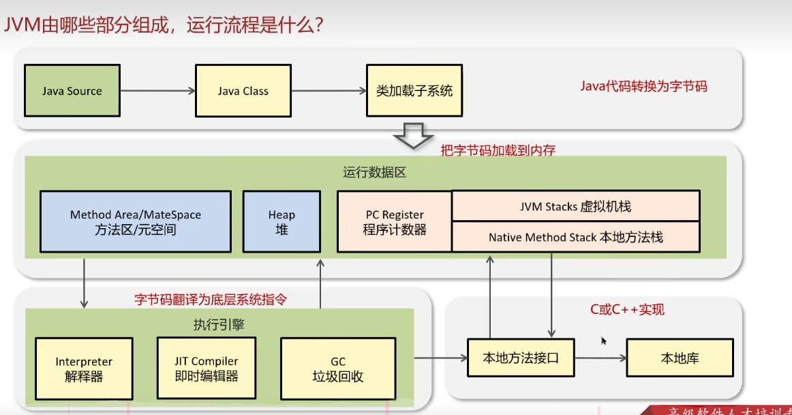

## 1. 程序计数器的作用，为什么是私有的？

作用是记录正在执行的虚拟机字节码指令的地址。

私用的原因是为了实现进程的切换。详细的再解释一下...

使用`javap -V xx.class` 命令来反编译字节码文件。

## 2. 你能详细的介绍一下java堆及其构成吗？

* java堆是虚拟机所管理的内存中最大的一块，是被所有线程共享的一块内存区域，在**虚拟机启动时创建**，主要用来存放对象实例和数组。

* 随着JVM的发展和不同垃圾收集器的实现，堆的具体划分可能会有所不同，但通常可以分为以下几个部分：

  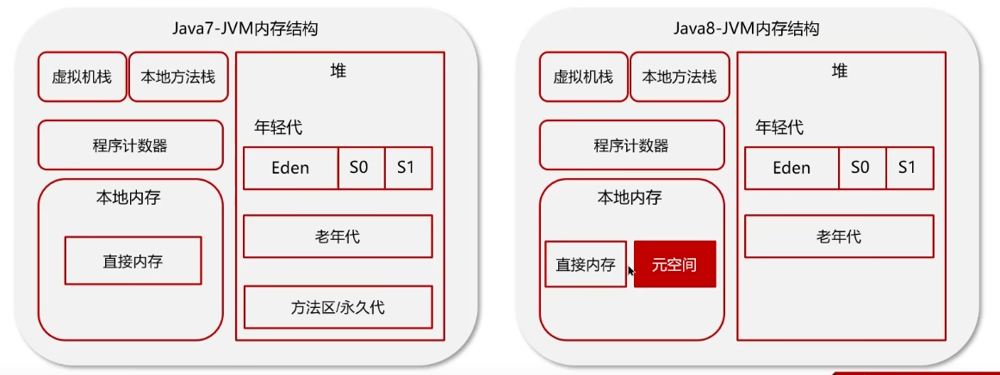

  * 新生代:新生代分为Eden Space和Survivor Space。在Eden Space中， 大多数新创建的对象首先存放在这里。Eden区相对较小，当Eden区满时，会触发一次Minor GC（新生代垃圾回收）。在Survivor Spaces中，通常分为两个相等大小的区域，称为S0（Survivor 0）和S1（Survivor 1）。在每次Minor GC后，存活下来的对象会被移动到其中一个Survivor空间，以继续它们的生命周期。这两个区域轮流充当对象的中转站，帮助区分短暂存活的对象和长期存活的对象。
  * 老年代（Old Generation/Tenured Generation）:经过一次或多次Minor GC仍存活的对象会被移动到老年代。老年代中的对象生命周期较长，因此Major GC（也称为Full GC，涉及老年代的垃圾回收）发生的频率相对较低，但其执行时间通常比Minor GC长。老年代的空间通常比新生代大，以存储更多的长期存活对象。
  * 元空间（Metaspace）:从Java 8开始，永久代（Permanent Generation）被元空间取代，用于存储类的元数据信息，如类的结构信息（如字段、方法信息等），静态变量，常量。编译后的代码。元空间并不在Java堆中，而是使用本地内存，这解决了永久代容易出现的内存溢出问题。
  * 大对象区（Large Object Space / Humongous Objects）:在某些JVM实现中（如G1垃圾收集器），为大对象分配了专门的区域，称为大对象区或Humongous Objects区域。大对象是指需要大量连续内存空间的对象，如大数组。这类对象直接分配在老年代，以避免因频繁的年轻代晋升而导致的内存碎片化问题。

## 3. 什么是虚拟机栈？

* 每个线程有一个私有的栈，随着线程的创建而创建。每个栈由多个栈帧组成，对应着每次方法调用时所占用的内存，栈帧中存放了局部变量表（基本数据类型和对象引用）、操作数栈、动态链接、方法出口等信息，每个线程只能有一个活动栈帧，对应这当前正在执行的那个方法。栈的大小可以固定也可以动态扩展。

* 垃圾回收是否涉及栈内存？

  垃圾回收主要指堆内存，当栈帧弹出时，内存就会释放。

* 栈内存分配越大越好吗？

  未必，默认的栈内存通常为1024K，栈过大会导致线程数变小。

* 方法内的局部变量是否线程安全？

  * 如果方法内局部变量没有逃离方法的作用范围，他是线程安全的
  * 如果局部变量引用了对象，并逃离方法的作用范围，需要考虑线程安全

* 什么情况会导致栈内存溢出？

  《Java虚拟机规范》中，对了虚拟机栈的两类异常情况

  1. 如果线程请求的栈深度大于虚拟机允许的深度，将抛出StackOverflowError异常；
  2. 如果java虚拟机栈容量可以动态扩展，当栈扩展到无法申请足够的内存会抛出OutOfMemoryError异常。

  

  

## 4. 能不能解释一下方法区？

* 方法区是各个线程共享的内存区域，用来存储以被虚拟机加载的类型信息、常量、静态变量、即时编译器编译后的代码缓存等，虚拟机启动的时候创建，关闭虚拟机时释放。

class文件包含类基本信息、常量池、方法定义。

## 5. 介绍一下运行时常量池

常量池是*.class文件中的，当该类被加载，它的常量池信息就会放入**运行时常量池**，并把里面的**符号地址变为真实地址**。符号地址就是指#1、2、3那个，真实地址就是内存地址了

类基本信息：

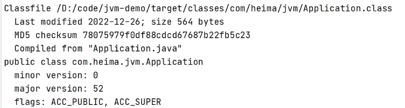

方法定义：

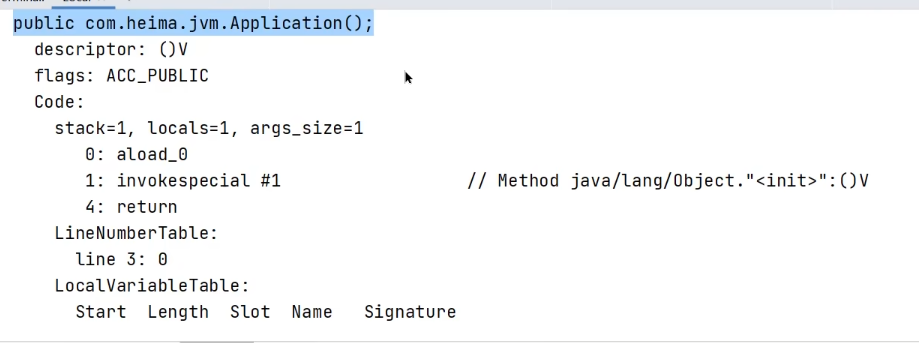

（无参构造函数）

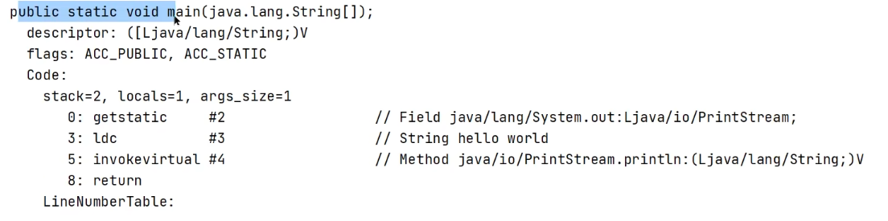

（mian方法）

常量池：

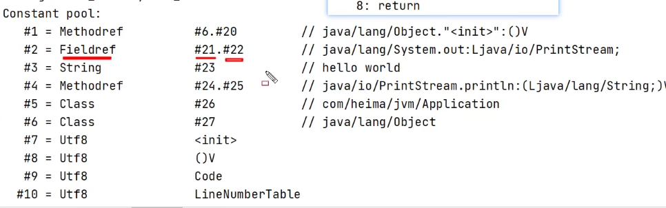

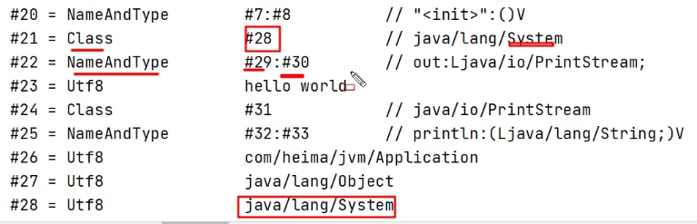

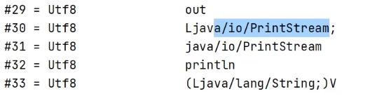

 ## 6. 你听过直接内存吗？

* 不是虚拟机运行时数据区的一部分，也不是jvm中的内存结构，不由jvm进行管理。是系统内存。

* 常见于NIO操作时，用于数据缓冲区，分配回收成本高，但读写性能高，不受JVM内存回收管理。

## 7. String保存在哪里呢？

## 8. String s = new String（“abc”）执行过程中分别对应哪些内存区域？

## 9.  引用类型有哪些？有什么区别？

## 10.  弱引用了解吗?举例说明在哪里可以用?

## 11. OOM发生在JVM的哪一块内存空间？

## 12.  jvm 内存结构有哪几种内存溢出的情况？

# 类初始化和类加载

## 13. 什么是类加载器。类加载器有哪些？

1. 类加载器是一个负责加载类的对象，他将字节码文件加载到jvm中，用于实现类加载过程中的加载这一步。
   * **类加载器的主要作用就是加载 Java 类的字节码（ `.class` 文件）到 JVM 中（在内存中生成一个代表该类的 `Class` 对象）。**

2. JVM 中内置了三个重要的 `ClassLoader`：
   1. **`BootstrapClassLoader`(启动类加载器)**：最顶层的加载类，由 C++实现，通常表示为 null，并且没有父级，主要用来加载 JDK 内部的核心类库（ `%JAVA_HOME%/lib`目录下的 `rt.jar`、`resources.jar`、`charsets.jar`等 jar 包和类）以及被 `-Xbootclasspath`参数指定的路径下的所有类。
   2. **`ExtensionClassLoader`(扩展类加载器)**：主要负责加载 `%JRE_HOME%/lib/ext` 目录下的 jar 包和类以及被 `java.ext.dirs` 系统变量所指定的路径下的所有类。
   3. **`AppClassLoader`(应用程序类加载器)**：面向我们用户的加载器，负责加载当前应用 classpath 下的所有 jar 包和类。

## 14. 讲一下类加载过程？

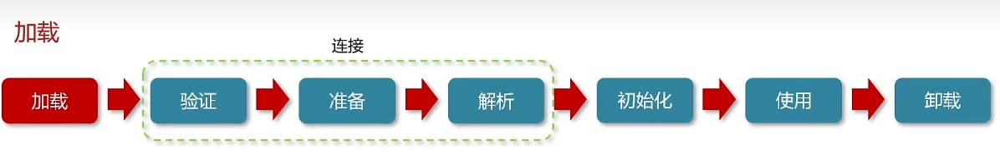

1. 加载

   1. 通过全类名获取定义此类的二进制字节流。

   2. 将字节流所代表的静态存储结构转换为方法区的运行时数据结构。

   3. 在内存中生成一个代表该类的 `Class` 对象，作为方法区这些数据的访问入口。

      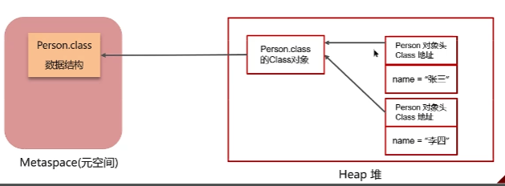

2. 验证

   1. 文件格式验证（Class 文件格式检查）
   2. 元数据验证（字节码语义检查）比如是否有父类，是否继承了final修饰的类
   3. 字节码验证（程序语义检查）比如类型转换是否合理，函数的参数类型是否正确
   4. 符号引用验证（类的正确性检查）比如使用的方法、类、字段是否存在、是否拥有正确的访问权限

   文件格式验证这一阶段是基于该类的二进制字节流进行的，主要目的是保证输入的字节流能正确地解析并存储于方法区之内，格式上符合描述一个 Java 类型信息的要求。除了这一阶段之外，其余三个验证阶段都是基于方法区的存储结构上进行的，不会再直接读取、操作字节流了。

3. 准备

   **准备阶段是正式为类变量分配内存并设置类变量初始值的阶段**

   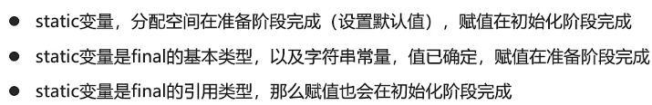

4. 解析

   **把类中的符号引用转化为直接引用**

5. 初始化

   **对类的静态变量，静态代码块执行初始化操作**

   

6. 使用

   **JVM开始从入口方法开始执行用户的程序代码**

   类初始化的时机：

   * 调用静态类成员信息，比如：静态字段、静态方法。
   * 使用new关键字为其创建对象实例。
   * 使用 `java.lang.reflect` 包的方法对类进行反射调用时如 `Class.forName("...")`, `newInstance()` 等等。如果类没初始化，需要触发其初始化。
   * 初始化一个类，如果其父类还未初始化，则先触发该父类的初始化。
   * 当虚拟机启动时，用户需要定义一个要执行的主类 (包含 `main` 方法的那个类)，虚拟机会先初始化这个类。
   * `MethodHandle` 和 `VarHandle` 可以看作是轻量级的反射调用机制，而要想使用这 2 个调用， 就必须先使用 `findStaticVarHandle` 来初始化要调用的类。
   *  当一个接口中定义了 JDK8 新加入的默认方法（被 default 关键字修饰的接口方法）时，如果有这个接口的实现类发生了初始化，那该接口要在其之前被初始化。

7. 卸载

   **卸载类即该类的 Class 对象被 GC。**

   卸载类需要满足 3 个要求:

   1. 该类的所有的实例对象都已被 GC，也就是说堆不存在该类的实例对象。
   2. 该类没有在其他任何地方被引用
   3. 该类的类加载器的实例已被 GC

   所以，在 JVM 生命周期内，由 jvm 自带的类加载器加载的类是不会被卸载的。但是由我们自定义的类加载器加载的类是可能被卸载的。

## 15. 什么是双亲委派模型？

* 加载某一个类，先委托上一级的加载器进行加载，如果上级加载器也有上级，则会继续向上委托，如果该类委托上级没有被加载，子加载器尝试加载该类。
* 为什么采用双亲委派机制？
  * 通过双亲委派机制可以避免某一个类被重复加载，当父类已经加载后则无需重复加载，保证唯一性。
  * 为了安全，保证类库API不会被修改。

## 16. 创建对象的过程？

## 17. 对象的生命周期？

## 垃圾回收

## 18. 判断垃圾的方法有哪些？

* 引用计数法
  1. 原理：为每个对象分配一个引用计数器，每当有一个地方引用它时，计数器加1；当引用失效时，计数器减1。当计数器为0时，表示对象不再被任何变量引用，可以被回收。
  2. 缺点：不能解决循环引用的问题，即两个对象相互引用，但不再被其他任何对象引用，这时引用计数器不会为0，导致对象无法被回收。
* 可达性分析算法
  1. 原理：从一组称为GC Roots（垃圾收集根）的对象出发，向下追溯它们引用的对象，以及这些对象引用的其他对象，以此类推。如果一个对象到GC Roots没有任何引用链相连（即从GC Roots到这个对象不可达），那么这个对象就被认为是不可达的，可以被回收。
  2. GC Roots对象包括：
     * 虚拟机栈（栈帧中的本地变量表）中引用的对象；
     * 方法区中静态属性引用的对象；
     * 方法区中常量引用的对象；
     * 本地方法栈中正在引用的对象

## 19. 垃圾回收算法有哪些？

* 标记-清除算法：标记-清除算法分为“标记”和“清除”两个阶段，首先通过可达性分析，标记出所有需要回收的对象，然后统一回收所有被标记的对象。
  * 标记-清除算法有两个缺陷，一个是效率问题，标记和清除的过程效率都不高，另外一个就是，清除结束后会造成**大量的碎片空间**。有可能会造成在申请大块内存的时候因为没有足够的连续空间导致再次 GC。
* 复制算法：为了解决碎片空间的问题，出现了“复制算法”。复制算法的原理是，将内存分成两块，每次申请内存时都使用其中的一块，当内存不够时，将这一块内存中所有存活的对象复制到另一块上。然后将已使用的内存整个清理掉。
  * 复制算法解决了空间碎片的问题。但是也带来了新的问题。因为每次在申请内存时，都只能使用一半的内存空间。内存利用率严重不足。
* 标记-整理算法：复制算法在 GC 之后**存活对象较少**的情况下效率比较高，但如果存活对象比较多时，会执行较多的复制操作，效率就会下降。而老年代的对象在 GC 之后的存活率就比较高，所以就有人提出了“标记-整理算法”。标记-整理算法的“标记”过程与“标记-清除算法”的标记过程一致，但标记之后不会直接清理。而是将所有存活对象都移动到内存的一端。移动结束后直接清理掉剩余部分。

## 20. 说一下JVM的分代回收算法？

* 分代回收算法将堆划分为两个部分，分别是新生代和老年代，内存比例是1：2。其中，新生代又被分为三个区域，分别是Eden区、幸存者区S0和幸存者区S1，内存分配比例是8：1：1。
* 分代回收策略是：
  1. 新创建的对象都会先分配到eden区。
  2. 当eden区内存不足时，标记eden区和S0区存活的对象，并通过复制算法复制到S1中。复制完毕后，eden区和S0区内存得到释放。
  3. 当eden区内存再次不足时，标记eden区和S1存活的对象并通过复制算法复制到S0中。复制完毕后，eden区和S1区内存得到释放。
  4. 依次类推，当幸存者区中的对象坚持过一定垃圾回收次数后（最多15次），会被移到老年代。

## 21. minorGC、majorGC、fullGC的区别，什么场景触发full GC

区别：

部分收集：

* minor GC：只对新生代进行垃圾收集，包括eden区和幸存者区。

  通常发生得非常频繁，因为年轻代中对象的生命周期较短，回收效率高，暂停时间相对较短。

* major GC：只对老年代进行垃圾收集。

  相比Minor GC，Major GC发生的频率较低，但每次回收可能需要更长的时间，因为老年代中的对象存活率较高。

* mixed GC：对整个新生代和部分老年代进行垃圾收集。

  G1收集器特有的。

整堆收集

* full GC：收集整个 Java 堆和方法区。

  Full GC是最昂贵的操作，因为它需要停止所有的工作线程（Stop The World），遍历整个堆内存来查找和回收不再使用的对象，因此应尽量减少Full GC的触发。

触发时机：

* minor GC：当Eden区空间不足时，JVM会触发一次Minor GC，将Eden区和一个Survivor区中的存活对象移动到另一个Survivor区或老年代（Old Generation）。
* major GC：当老年代空间不足时，或者系统检测到年轻代对象晋升到老年代的速度过快，可能会触发Major GC。
* full GC：
  * 直接调用**System.gc()**或**Runtime.getRuntime().gc()**方法时，虽然不能保证立即执行，但JVM会尝试执行Full GC。
  * Minor GC（新生代垃圾回收）时，老年代的连续空间小于新生代对象总大小或者历次晋升的平均大小，则会触发Full GC，对整个堆内存进行回收。（空间分配担保）
  * 当永久代（Java 8之前的版本）或元空间（Java 8及以后的版本）空间不足时。

## 22. 垃圾回收器有哪些

串行回收：阻塞用户线程，仅有一个回收线程进行垃圾回收。

并行回收：阻塞用户线程，有多个回收线程并行进行垃圾回收。

并发回收：不阻塞用户线程，和用户线程并发执行。

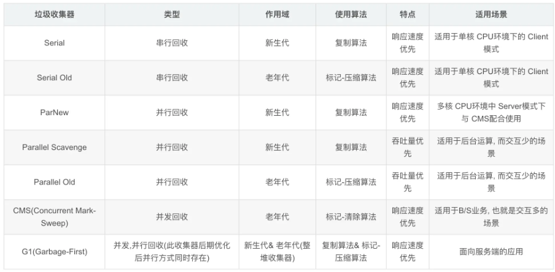

## 23. CMS垃圾收集器

回收步骤：

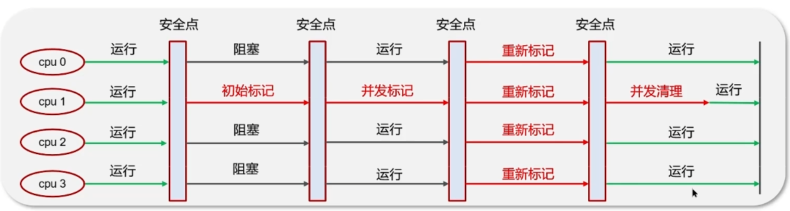

1. 初始标记 （串行 STW）：标记GCroot的直接引用的对象
2. 并发标记：继续向下探索，追踪当前引用链
3. 重新标记 （并行 STW）：因上一步是并发标记，用户线程有运行，所以重新标记。
4. 并发清除

## 23.详细说一下G1垃圾回收器

* G1收集器收集范围是老年代和新生代。在jdk9之后默认使用G1。

* G1采用复制算法，并将内存划分成多个区域，每个区域都可以充当eden、survivor、old和humongous，其中humongous转为大对象准备，可以同时兼顾相应时间和吞吐量。

* G1回收垃圾分为三个阶段

  1. 新生代回收（并行）
     * 新创建的对象，会挑出一些空闲区域作为eden存储这些对象，当eden需要垃圾回收时，挑出一个空闲区作为幸存区，用复制算法复制存活对象，这时需要暂停用户线程。当eden内存再次不足时，会将eden和幸存者区中的存活对象复制到新的幸存者区中，其中较老的对象会晋升到老年代中。
  2. 并发标记
     * 当老年代占用内存超过阈值（默认时45%）后，触发标记，这时无需暂停用户线程。
  3. 最终标记（并行）
     * 并发标记后会再进行一次重新标记存活对象，这时需要暂停用户线程。
  4. 混合收集（并发）
     * 此时老年代已经知道了有哪些存活对象，随后进入混合收集阶段。此时不会对所有老年代区域进行收集，而是根据**预期暂停时间**优先回收价值高（存活对象少）的区域，将这些区域连同eden区和幸存者区一起进行一次混合收集。混合收集可能会重复执行多次。

  当并发失败（回收速度赶不上创建新对象速度），会触发full GC。

## 24. 强引用、软引用、弱引用和虚引用的区别

**1．强引用（StrongReference）**

* 以前我们使用的大部分引用实际上都是强引用，这是使用最普遍的引用。
* 当内存空间不足，Java 虚拟机宁愿抛出 OutOfMemoryError 错误，使程序异常终止，也**不会靠随意回收具有强引用的对象来解决内存不足问题。**

**2．软引用（SoftReference）**

* 需要配合SoftReference使用
* **如果内存空间足够，垃圾回收器就不会回收它，如果内存空间不足了，就会回收这些对象的内存。**只要垃圾回收器没有回收它，该对象就可以被程序使用。软引用可用来实现内存敏感的高速缓存。

* 软引用可以和一个引用队列（ReferenceQueue）联合使用，如果软引用所引用的对象被垃圾回收，JAVA 虚拟机就会把这个软引用加入到与之关联的引用队列中。

**3．弱引用（WeakReference）**

* 需要配合WeakReference使用
* 弱引用与软引用的区别在于：只具有弱引用的对象拥有更短暂的生命周期。在垃圾回收器线程扫描它所管辖的内存区域的过程中，**一旦发现了只具有弱引用的对象，不管当前内存空间足够与否，都会回收它的内存。**不过，由于垃圾回收器是一个优先级很低的线程， 因此不一定会很快发现那些只具有弱引用的对象。
* 弱引用可以和一个引用队列（ReferenceQueue）联合使用，如果弱引用所引用的对象被垃圾回收，Java 虚拟机就会把这个弱引用加入到与之关联的引用队列中。

**4．虚引用（PhantomReference）**

* "虚引用"顾名思义，就是形同虚设，与其他几种引用都不同，虚引用并不会决定对象的生命周期。如果一个对象仅持有虚引用，那么它就和没有任何引用一样，在**任何时候都可能被垃圾回收。**

"虚引用"顾名思义，就是形同虚设，与其他几种引用都不同，虚引用并不会决定对象的生命周期。如果一个对象仅持有虚引用，那么它就和没有任何引用一样，在任何时候都可能被垃圾回收。

**虚引用与软引用和弱引用的一个区别在于：** **虚引用必须和引用队列（ReferenceQueue）联合使用**。当垃圾回收器准备回收一个对象时，如果发现它还有虚引用，就会在回收对象的内存之前，把这个虚引用加入到与之关联的引用队列中。程序可以通过判断引用队列中是否已经加入了虚引用，来了解被引用的对象是否将要被垃圾回收。程序如果发现某个虚引用已经被加入到引用队列，那么就可以在所引用的对象的内存被回收之前采取必要的行动。

特别注意，在程序设计中一般很少使用弱引用与虚引用，使用软引用的情况较多，这是因为**软引用可以加速 JVM 对垃圾内存的回收速度，可以维护系统的运行安全，防止内存溢出（OutOfMemory）等问题的产生**。